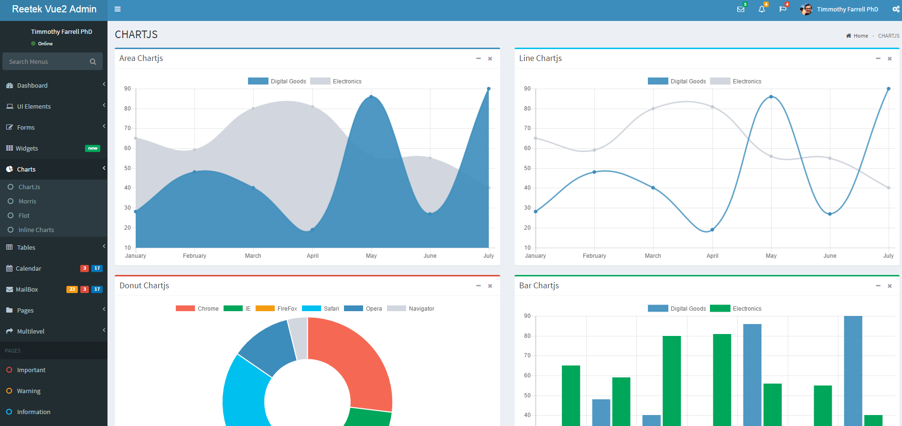

**Vue2Admin** is a fully responsive admin template that is inspired by [AdminLTE](https://almsaeedstudio.com). 

* This template is built-in with Vue 2 at the start.
* It include Vue Resource, Vuex as well.
* The plugins for this project are loaded with script loader. 
* Chart.js has been upgraded to 2.x.x 


#### Screenshots




#### Download:

Download from Github

#### Using The Command Line:

```
git clone https://github.com/harryho/Vue2Admin.git
```


#### Build Setup

``` bash
# install dependencies
npm install

# dev with hot reload at localhost:8080
npm run dev

# build for production with minification
npm run build
```

